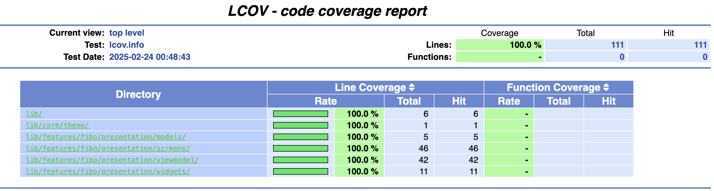

# Fibonacci List App

This project is an assignment for state management in Flutter. It demonstrates the following features:

1. **Scrollable Widget**: A widget that allows scrolling in any direction, containing a list of at least the first 40 Fibonacci numbers.
2. **Display Widget**: Each Fibonacci number is displayed alongside a symbol or icon representing its type (e.g., square, cross, circle).
3. **Tap Functionality**: Tapping a number displays a BottomSheet containing items of the same type. Tapping an item in the BottomSheet removes it from the BottomSheet, adds it back to the main list, highlights it, and scrolls to it.

## Features

### 1. Scrollable Widget
- A list of Fibonacci numbers that allows scrolling.
- Contains at least the first 40 Fibonacci numbers.

### 2. Display Widget
- Each Fibonacci number is displayed with:
  - The number itself (e.g., 0, 1, 1, 2, 3, 5, ...).
  - A symbol or icon representing the type associated with that Fibonacci number (e.g., square, cross, circle).

### 3. Tap Functionality
- Tapping a number displays a BottomSheet with items of the same type.
- Tapping an item in the BottomSheet:
  - Removes the item from the BottomSheet.
  - Adds it back to the main list.
  - Highlights the item in the main list.
  - Scrolls to the highlighted item.

## Bonus
- Implemented without third-party libraries.

## Getting Started

### Prerequisites
- Flutter SDK (Version: 3.29.0)
- Dart SDK

### Installation & Run
1. Clone the repository:
   ```sh
   git clone https://github.com/yourusername/fibonacci_list_app.git

2. Navigate to the project directory:
    cd fibonacci_list_app

3. Get the dependencies:
    fvm use 3.29.0
    fvm flutter pub get

4. Running the App (Run the app on an emulator or physical device)
    fvm flutter run

### Running Tests
1. Run Unit Tests:
    fvm flutter test test/presentation/viewmodel/fibo_viewmodel_test.dart

2. Run Widget Tests:
    fvm flutter test test/widget_test.dart

3. Run Golden Tests:
   1. Create golden images:
    fvm flutter test --update-goldens
   2. Run golden tests:
    fvm flutter test test/golden_test/fibo_screen_golden_test.dart

4. Run Integration Tests:
    fvm flutter test test/integration_test/integration_test.dart

5. Run All Test
    fvm flutter test

## Project Structure
```
assign_fibo_mobile/
├── lib/
│   ├── core/
│   │   └── theme/
│   │       ├── app_colors.dart
│   │       └── app_theme.dart
│   ├── features/
│   │   └── fibo/
│   │       ├── presentation/
│   │       │   ├── models/
│   │       │   │   └── fibo_model_ui.dart
│   │       │   ├── screens/
│   │       │   │   └── fibo_screen.dart
│   │       │   ├── viewmodel/
│   │       │   │   └── fibo_viewmodel.dart
│   │       │   └── widgets/
│   │       │       └── fibo_list_tile.dart
│   └── main.dart
├── test/
│   ├── golden_test/
│   │   ├── fibo_screen_golden_test.dart
│   │   └── golden/
│   │       └── fibo_screen.png
│   ├── integration_test/
│   │   └── integration_test.dart
│   ├── presentation/
│   │   └── viewmodel/
│   │       └── fibo_viewmodel_test.dart
│   └── widget_test.dart
```
State Management
The project uses the MVVM pattern with ChangeNotifier and AnimatedBuilder for state management.  
Example of Display list Fibonacci Display list Fibonacci  
  

Example of added item only the same type Added item only the same type  
  

Example of When scrolling to highlighted one when showing modal Scrolling to highlighted item  
  

Example of what to do when pop When pop  
  

Coverage Report  
  

